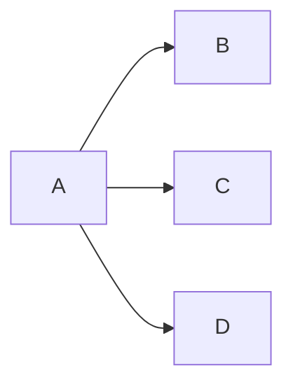

# 一级标题 省了57r
## 二级标题
### 三级标题
Ctrl+/切换为源代码模式

**加粗**
*倾斜*
~~删除线

== 高亮 ==
我是^上标^
我是~下标~

+ 一二三四五
	+上山打老鼠
    	老虎没打到

1.一二三四五

| Thu  | MON  | Tue  |      |      |      |
| :--- | ---- | ---- | ---- | ---- | ---- |
|      |      |      |      |      |      |
|      |      |      |      |      |      |
|      |      |      |      |      |      |

> ---------------------
>
> `System.out.println("HelloWorld");`

LR表示：left to Right     ```Mermaid  ——>流程图（graph LR;
	A-->B;
	A-->C;
	A-->D;）



RL表示：right to Left
TD表示：top-down
DT表示：down-top

[我的个人博客](https://www.cnblogs.com/fjh666/)